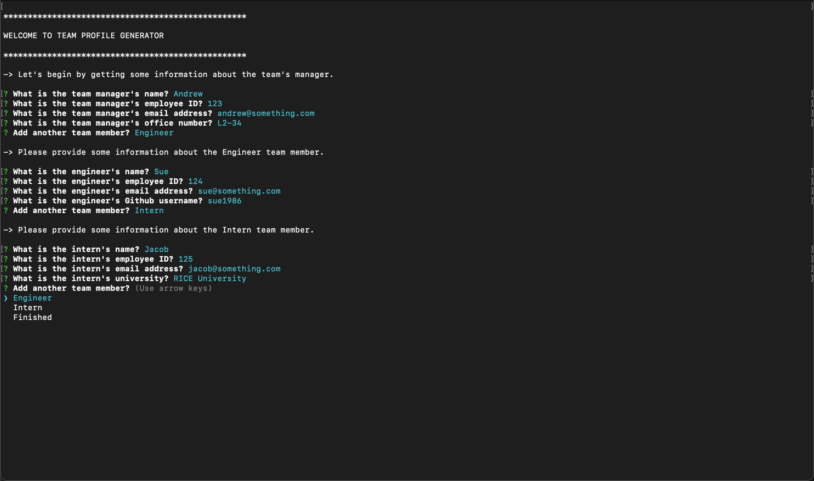
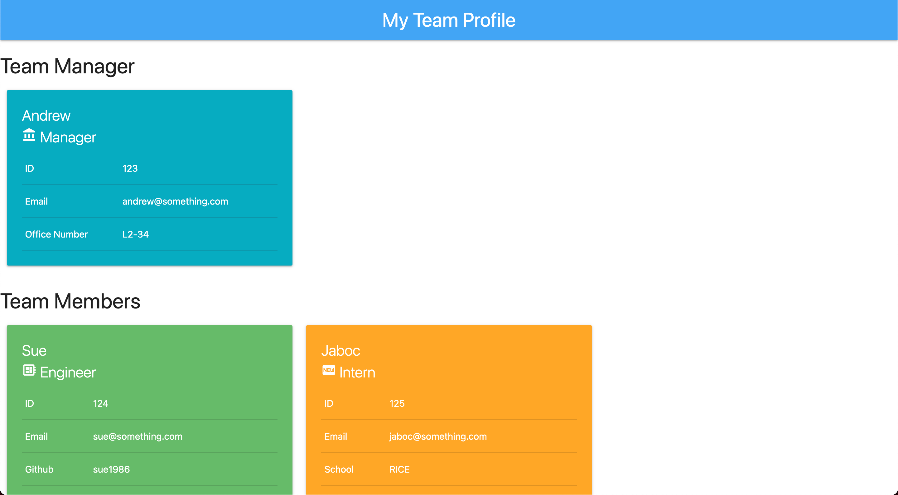

# team-profile-generator

## Table of Contents

1. [Description](#description)
1. [Usage](#usage)
1. [User Story](#user-story)
1. [Acceptance Criteria](#acceptance-criteria)
1. [Licenses](#licenses)
1. [Technology](#technology)
1. [Mock-up](#mock-up)
1. [Support](#support)
   - [Installation](#installation)
   - [Questions](#questions)
1. [References](#references)

## Description
Takes information about employees on a team and generates an HTML webpage that displays summaries for each person.

## Usage
You can access the app here: [https://github.com/avidrunner87/team-profile-generator](https://github.com/avidrunner87/team-profile-generator).

## User Story
>**AS A(N)** manager<br>I **WANT** to generate a webpage that displays my team's basic info<br>**SO THAT** I have quick access to their emails and GitHub profiles.


## Acceptance Criteria
**GIVEN** a command-line application that accepts user input

>**WHEN** I am prompted for my team members and their information<br>
**THEN** an HTML file is generated that displays a nicely formatted team roster based on user input

>**WHEN** I click on an email address in the HTML<br>
**THEN** my default email program opens and populates the TO field of the email with the address

>**WHEN** I click on the GitHub username<br>
**THEN** that GitHub profile opens in a new tab

>**WHEN** I start the application<br>
**THEN** I am prompted to enter the team manager’s name, employee ID, email address, and office number

>**WHEN** I enter the team manager’s name, employee ID, email address, and office number<br>
**THEN** I am presented with a menu with the option to add an engineer or an intern or to finish building my team

>**WHEN** I select the engineer option<br>
**THEN** I am prompted to enter the engineer’s name, ID, email, and GitHub username, and I am taken back to the menu

>**WHEN** I select the intern option<br>
**THEN** I am prompted to enter the intern’s name, ID, email, and school, and I am taken back to the menu

>**WHEN** I decide to finish building my team<br>
**THEN** I exit the application, and the HTML is generated


## Licenses
[](https://github.com/avidrunner87/team-profile-generator/blob/main/LICENSE.md)

## Technology


## Mock-up
The following picture shows the website appearance and capabilities:

<br>



We also have a video that walks you through the entire application:

[Access Video](https://github.com/avidrunner87/team-profile-generator/blob/main/assets/images/screenshots/walkthrough.mp4)

## Support
### Installation
To fork this code to further improve the website, please follow these directions:

1. In Github fork the repository.
1. Clone the repository to your local computer.

_This assumes that you have setup your own SSH keys to connect with Github._

1. Before running the team-profile-generator, please ensure all the necessary node modules are installed:

```
npm install
```

### Questions
If you have any questions please reach out to me via [Github](https://github.com/avidrunner87) or via [email](mailto:andrew.ronchetto@me.com).

## References
[Inquirer.js](https://github.com/SBoudrias/Inquirer.js#readme)<br>
[JEST](https://jestjs.io/)
